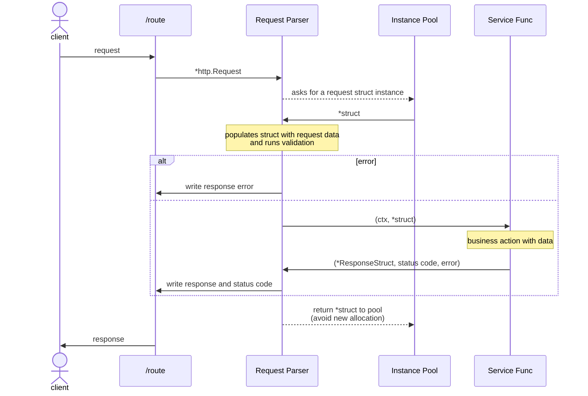

# Components

```mermaid
sequenceDiagram
    actor client
    participant route  as /route
    participant parser as Request Parser
    participant pool as Instance Pool
    participant service as Service Func
    client ->> route: request
    route ->> parser: *http.Request
    parser -->> pool: asks for a request struct instance
    pool ->> parser: *struct
      note over parser: populates struct with request data<br/>and runs validation
      alt error
        parser ->> route: write response error
      else
        parser ->> service: (ctx, *struct)
        note over service: business action with data
        service ->> parser: (*ResponseStruct, status code, error)
        parser ->> route: write response and status code
      end

    parser -->> pool: return *struct to pool<br/> (avoid new allocation)
    route ->> client: response
```
