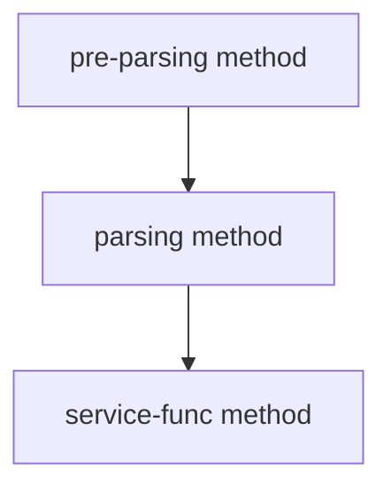

# Error Handling

In the request parsing [flow](../concepts/request-flow.md), some checkings can result in errors.

Chronologically:



The error returned can be used to create the response to HTTP client.

## Error interfaces

```go
type HttpError interface {
        error
        Status() int
    }

type HttpJsonError interface {
        HttpError
        Json() []byte
    }
```

## Status code

If the error implements the method `Status() int`, the value returned by the func will be used as StatusCode of the response (default to 500 if non-positive).

## JSON error

If the error implements the method `Json() []byte`, the returned data will be written to the http.ResponseWriter with the header `Content-Type: application/json`.
